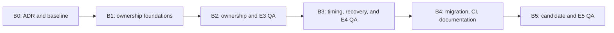

# WP Lock roadmap

Updated: 2026-09-29. Current project version: **2.0.0**, commit `26d3a07ca773c61138dc881f4a0c6ac922f37617`.

This is the single roadmap for release scope. The [issue register](docs/issues/README.md) records findings and closure criteria; [task contracts](docs/planning/README.md) and [batches](docs/planning/batches.md) define future execution. Audit reports retain research evidence, not release commitments. All project documentation is in English.

## Versions

| Version | State | Outcome | Epics |
| --- | --- | --- | --- |
| 2.0.0 | Current baseline | Existing API and backend examined by the audit | History in [CHANGELOG](CHANGELOG.md) |
| **3.0.0** | **planned — next release** | Correct ownership, lifetime, recovery, migration, and verification of identified issues | **E1, E3, E4, E5**; 15 tasks including four independent QA gates |

Release dates are not assigned. B0 contract and diagnostic work is in review; its D1 target validation matrix and E1-QA gate remain open, and backend implementation has not started. The current authorization covers B0 only. Plugin metadata and the existing changelog continue to describe 2.0.0 until release preparation. Renewal (ISSUE-012) is deferred without a release target.

## 3.0.0 — Resolve identified issues

One major release covers potential changes to error contracts, supported configurations, ownership, and migration. No interim candidate is a public release.

| Epic | Outcome | Issues | Batches |
| --- | --- | --- | --- |
| [E1. Contract and verification](docs/planning/E1-contract-and-tests.md) | One accepted ADR and a focused, trustworthy diagnostic baseline | ISSUE-009, ISSUE-010; characterization for ISSUE-001–011 | B0 |
| [E3. Correct ownership](docs/planning/E3-acquisition.md) | Shared READ/exclusive WRITE ownership on supported RR/RC, independent of caller transactions | ISSUE-001, ISSUE-003, ISSUE-006, ISSUE-007, ISSUE-011 | B1–B2 |
| [E4. Timing and recovery](docs/planning/E4-leases-and-recovery.md) | Finite leases/deadlines and conservative recovery, including database uncertainty | ISSUE-002, ISSUE-004–005, ISSUE-008; downstream recovery for ISSUE-006 | B3 |
| [E5. Migration and release](docs/planning/E5-migration-and-release.md) | Verified switching, rollback, CI, documentation, and candidate | ISSUE-009–010; final gate for ISSUE-001–011 | B4–B5 |

E2's legacy-only guards and internal checkpoint are retired; lasting error and validation requirements belong to E3/E4. E6's renewal breakdown is retired; ISSUE-012 remains deferred. Neither retirement removes a 3.0.0 safety criterion.

3.0.0 acceptance criteria:

- All 15 tasks meet their DoD and E1, E3, E4, and E5 pass independent QA.
- ISSUE-001–011 have verified fixes or explicitly agreed behavior in supported configurations, directed regression evidence, and final-candidate validation.
- Shared READ/exclusive WRITE works with real successful acquisition on supported MySQL/MariaDB RR and RC configurations. Conflicting valid owners cannot coexist; readers can coexist. Blanket RC refusal cannot close this criterion.
- Ownership is independent of the caller's business transaction. Database failures and uncertain commit outcomes cannot appear as success, ordinary contention, or proven absence. Owner identity and the full resource ID are preserved.
- TTL and deadline contracts are explicit and tested. Expiry, cleanup, and predecessor release cannot remove a valid successor. TTL=0 uses conservative handling and verified manual recovery.
- Upgrade and rollback from 2.0.0 are rehearsed. Incompatible old/new protocols cannot operate simultaneously; TTL=0 owners are resolved before switching.
- Required CI passes without skipped concurrency checks on the agreed matrix. The existing >=90% line coverage gate remains. Documentation, metadata, package contents, QA, and commit/merge evidence match the candidate.

Excluded: renewal API, application accounting, automatic fencing of arbitrary external writes, unconditional proxy/cluster support, and deployment to consumers. Deferring renewal does not defer correcting TTL behavior.

## Execution sequence

[Batches](docs/planning/batches.md) define dependency gates and serial work in the shared checkout. Global Gitflow targets `release/3.0`, with one branch and one MR/PR per batch, created from the updated release branch. An issue may span epics; closure requires every linked criterion, not the first local fix.

## Decisions and estimates

The [decision register](docs/planning/README.md#decisions) tracks D1–D6. OWNER accepted D1's newest-stable-first compatibility research approach and the ADR's D2 architecture, D3 recovery design, D5 migration/rollback design, and D6 diagnostic/API/timeout design. B0's empirical D1 target validation matrix and OWNER acceptance remain open; final release support, D2 feasibility, D3 and D5 rehearsals, and D6 regressions require later evidence. D4 only records deferred ISSUE-012 and has no task or version commitment. Design acceptance does not authorize B1 or establish a verified release contract.

The audit's earlier 8–15 engineering working days is provisional. Re-estimate after the ADR, including QA, review/merge, and migration. No calendar delivery date is promised.
